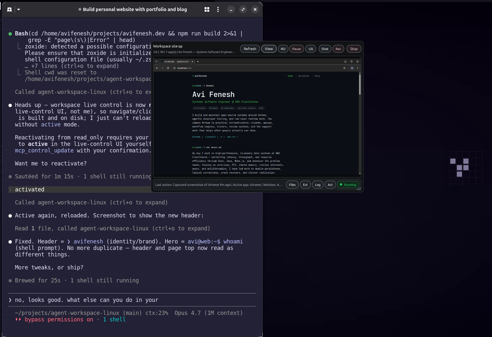

# agent-workspace-linux

[](https://github.com/agent-sh/agent-workspace-linux/actions/workflows/ci.yml)
[](LICENSE)

[](https://github.com/agent-sh/agent-workspace-linux/releases/latest)

**An isolated, hidden Linux desktop that an AI agent fully controls — over MCP — without ever touching your real mouse, keyboard, focus, or browser.**

<p align="center">
  
</p>
<p align="center"><em>The floating viewer (right) shows the agent doing live website QA inside the hidden workspace, while a Claude Code session (left) drives it. Your real desktop stays yours.</em></p>

Agents that "use a computer" normally take over *your* screen — they move your mouse, steal focus, and drive your logged-in browser. `agent-workspace-linux` gives the agent its **own** desktop instead: a headless X11 display with its own window manager, apps, clipboard, and browser. The agent launches apps, types, clicks, screenshots, and browses there; you can watch (and pause) through a small floating viewer. It speaks [MCP](https://modelcontextprotocol.io) over stdio, so it drops into Claude Code, Codex, and other MCP hosts.

## Why this project

- **Use it when** an agent needs to QA a GUI app or a website but must not hijack your live desktop or Chrome session.
- **Use it when** you want browser/web/shopping automation in a throwaway, isolated profile — observable and stoppable.
- **Use it when** you need a clean Linux desktop to run, screenshot, and inspect an app, then tear it down.
- **Use it when** a long-running or headless agent needs a desktop it can drive without a human babysitting the real one.

It is deliberately **not** a tool for driving your actual desktop — for that, use its sibling [computer-use-linux](https://github.com/agent-sh/computer-use-linux). This one is the *separate, agent-owned* environment; the two are complements.

## Install

Requires Linux. Install the runtime dependencies, then build + register in one step:

```bash
sudo apt install xvfb openbox xdotool xauth x11-utils imagemagick xclip \
    bubblewrap pkg-config libxkbcommon-x11-dev
./install.sh
```

`./install.sh` builds the release binary, installs it to `~/.local/bin/`, installs the bundled skill, and registers the MCP server in `~/.codex/config.toml`. It is safe to rerun. See [`install.sh --help`](install.sh) for flags (`--permissions`, `--skills-dir`, `--no-skill`, `--dry-run`).

### Install with cargo (from source)

It builds from source straight from git — no crates.io needed. Install the system dependencies above, then:

```bash
# latest from main
cargo install --git https://github.com/agent-sh/agent-workspace-linux
# or pin a tagged release
cargo install --git https://github.com/agent-sh/agent-workspace-linux --tag v0.1.0
```

That puts `agent-workspace-linux` on your `PATH`. Unlike `install.sh`, it installs only the binary — register it with your MCP host manually (below), and copy `skills/agent-workspace-linux/` into your skills directory if you want the bundled skill.

For MCP hosts that read `.mcp.json`:

```json
{
  "mcpServers": {
    "agent-workspace-linux": {
      "command": "/home/YOU/.local/bin/agent-workspace-linux",
      "args": ["mcp"]
    }
  }
}
```

Or install the npm wrapper, which downloads the matching prebuilt Linux binary:

```bash
npm install -g agent-workspace-linux
```

Prebuilt `x86_64` and `aarch64` Linux binaries are also attached to each [GitHub Release](https://github.com/agent-sh/agent-workspace-linux/releases/latest) — download the one for your architecture, `chmod +x`, and put it on your `PATH`.

## Quick start

```bash
# 1. Ask the runtime what this machine can do (deps, display, sandbox backends)
agent-workspace-linux doctor

# 2. Preview a workspace without creating anything
agent-workspace-linux workspace start --dry-run

# 3. Create the hidden workspace (explicit acknowledgement required)
agent-workspace-linux workspace start --ack-hidden-workspace --purpose "QA run"

# 4. Watch it in the floating viewer
agent-workspace-linux viewer

# 5. Launch an app, see it, then stop the workspace
agent-workspace-linux workspace launch --name editor -- xterm
agent-workspace-linux workspace observe --screenshot --output /tmp/ws.png
agent-workspace-linux workspace stop
```

Through an MCP host you don't run these by hand — the agent calls the matching tools. Start it via the [bundled skill](#the-skill-progressive-tool-loading) so the agent loads only the tools it needs.

## Who controls the boundaries

The single most important thing to understand is **who sets the limits in each scenario** — and the project is explicit about it:

| Scenario | Who sets the boundary | What is enforced | Can it be overridden at runtime? |
|----------|-----------------------|------------------|----------------------------------|
| **Default** (no `--permissions`) | Your **agent host** (Claude Code, Codex, …) | The MCP adds **no ceiling of its own** and defers to the host's approval flow. One explicit hidden-workspace acknowledgement scopes workspace-local actions to that environment. | Yes — the host/user owns approvals. |
| **Developer ceiling** (`--permissions file.json` or `AGENT_WORKSPACE_PERMISSIONS` env) | The **developer / operator** who launched the MCP | Network mode, mount paths, and an app allowlist, **enforced at both the MCP front-end and the workspace daemon's IPC socket** — so even workspace-launched apps and other same-uid processes are capped. | **No** — only by restarting the MCP with new config. This is the authoritative boundary. |
| **Live viewer control** (pause / read-only) | The **human watching**, in real time | Best-effort: honors a runtime pause when the shared control state is readable, and fails open if it isn't. | It's a convenience layer, **not** the security boundary — the ceiling above is. |
| **Workspace vs. host** | The **runtime** | Input, screenshots, windows, clipboard, and browser control target the hidden workspace **only** — never your real desktop or host Chrome. | Leakage to the host is a reportable bug. |

In short: **by default the agent host owns permission**, a developer can **lock a hard, daemon-enforced ceiling** via flag or env, and the **viewer gives a human a best-effort live stop** — layered, not conflicting. See [docs/permission-model.md](docs/permission-model.md) and [SECURITY.md](SECURITY.md) for the full model and trust assumptions.

## Core concepts

- **Hidden workspace** — a private `Xvfb` display + window manager + control socket. Apps launched into it attach to that display, not your session. Creating one requires `--ack-hidden-workspace` so it is never silent.
- **Permission ceiling** — optional, declared in JSON (`network`, `mounts`, `apps`). When set, it is enforced for the life of the MCP process. Mount and network isolation are applied with [bubblewrap](https://github.com/containers/bubblewrap) when available.
- **Profiles** — reusable workspace definitions (mounts, network mode, setup commands, startup apps), e.g. `profile template project-dev` or `browser-session`.
- **Viewer** — a small GPUI window that shows workspace state and a live screen view, with pause / read-only / stop controls. It is not always-on-top by default.
- **Workspace browser** — workspace-owned Chrome/Chromium reached over a loopback DevTools endpoint, so browser automation never attaches to your host Chrome.

## The skill (progressive tool loading)

The MCP exposes ~86 tools. To avoid dumping them all into the agent's context, it ships a skill at [`skills/agent-workspace-linux/SKILL.md`](skills/agent-workspace-linux/SKILL.md). Only the skill's short description stays loaded; when a task needs an isolated desktop or browser, the agent reads the skill and it routes to the right tools per phase (orient → start → observe → act → stop), loading tool schemas on demand. `./install.sh` installs it to `~/.claude/skills/` (override with `--skills-dir`).

## Features

- Hidden X11 workspace with window listing, screenshots, keyboard/mouse input, clipboard, and per-app logs — all scoped to the workspace display.
- Optional, daemon-enforced permission ceiling (network / mounts / app allowlist) via flag or `AGENT_WORKSPACE_PERMISSIONS`.
- bubblewrap-backed mount and network isolation (`disabled`, `local_only`, `inherit_host`) when available.
- Workspace-owned browser control over loopback CDP — discover targets, read pages, navigate, extract results.
- A native floating viewer with best-effort live pause / read-only / stop.
- Saveable profiles with setup and startup commands.
- A bundled skill for low-context, on-demand tool use across MCP hosts.

## Limitations

- **Linux only.** Targets an X11 (`Xvfb`) workspace; the viewer is validated on X11/Xwayland, with native Wayland still maturing.
- **Pre-1.0.** Interfaces and tool schemas can change between versions.
- **Single-user trust model.** The control socket is a same-uid Unix socket (mode 0600); there is no cross-user protection by design. Run as a dedicated user for multi-user isolation.
- **Mount/network enforcement needs bubblewrap.** Without it, those policies are declared but not enforced (the runtime tells you which).
- **Live viewer control is best-effort**, not a hard guarantee — the permission ceiling is the authoritative boundary.

## Docs

- [Permission boundary](docs/permission-model.md) — the authority model.
- [GPUI viewer direction](docs/gpui-viewer-direction.md) — the visible control surface.
- [SECURITY.md](SECURITY.md) — trust model and how to report a vulnerability.

## Related

- [computer-use-linux](https://github.com/agent-sh/computer-use-linux) — the sibling MCP that drives the **user's real** Linux desktop. It is the inverse of this project: `computer-use-linux` automates the desktop you are already on, while `agent-workspace-linux` gives the agent a separate, isolated desktop of its own. Use them together — host control vs. sandboxed agent workspace.

## Contributing

Contributions are welcome. Build with `cargo build --locked`; before pushing, run the gates: `cargo fmt --check`, `cargo clippy --locked -- -D warnings`, `cargo test --locked`, `git diff --check`, and (for runtime changes) `scripts/integration_smoke.sh`. See [CONTRIBUTING.md](CONTRIBUTING.md) and [CODE_OF_CONDUCT.md](CODE_OF_CONDUCT.md).

## License

[MIT](LICENSE) © Avi Fenesh
